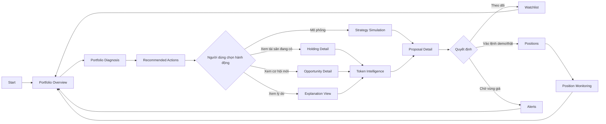
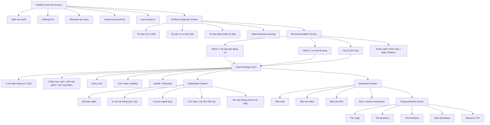
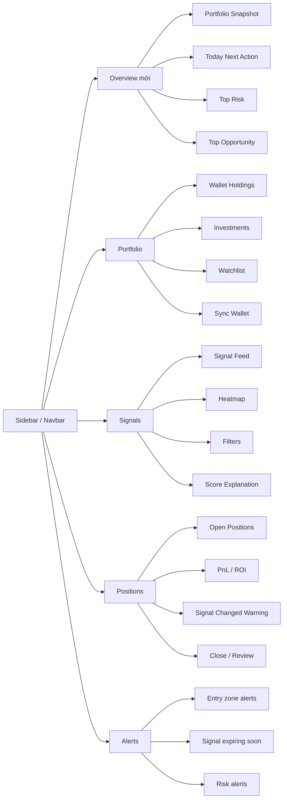
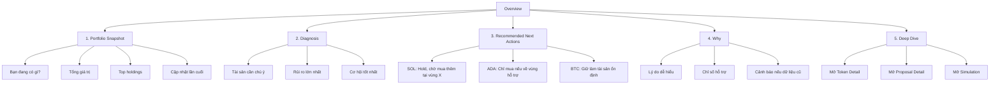
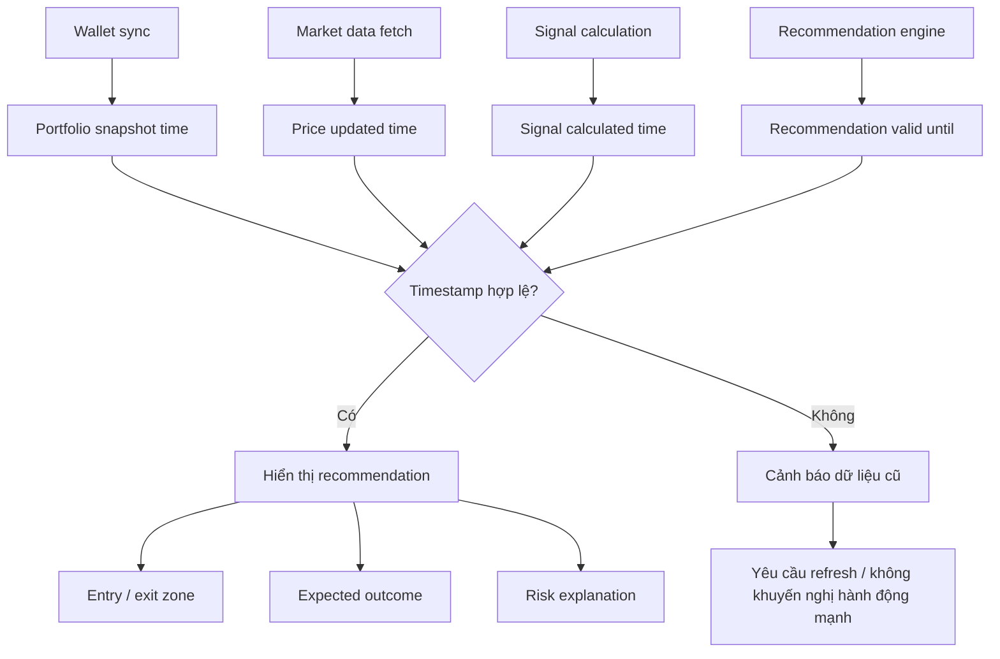
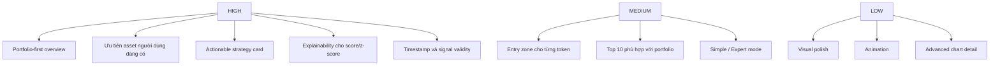

# UI Flow - Portfolio-first Recommendation

Tài liệu này mô tả lại luồng màn hình UI theo góp ý reviewer: người dùng cần đi từ **đang có tài sản gì** -> **nên làm gì** -> **vì sao** -> **được/mất gì**.

## 1. Functional Decomposition

```mermaid
flowchart TD
    A["Ứng dụng hỗ trợ quyết định đầu tư"] --> B["Portfolio"]
    A --> C["Recommendation"]
    A --> D["Signal Analysis"]
    A --> E["Strategy Simulation"]
    A --> F["Explainability"]
    A --> G["Position Monitoring"]

    B --> B1["Sync wallet"]
    B --> B2["Xem tài sản đang có"]
    B --> B3["Phân bổ vốn"]
    B --> B4["Tài sản ưu tiên phân tích"]

    C --> C1["Khuyến nghị theo tài sản đang có"]
    C --> C2["Cơ hội ngoài portfolio"]
    C --> C3["Top phù hợp với portfolio"]
    C --> C4["Next action: Hold / Buy / Wait / Reduce"]

    D --> D1["Signal score"]
    D --> D2["Z-score"]
    D --> D3["Confidence"]
    D --> D4["Backtest outcome"]
    D --> D5["Signal validity time"]

    E --> E1["Nếu giữ"]
    E --> E2["Nếu mua thêm"]
    E --> E3["Nếu bán một phần"]
    E --> E4["Expected upside / downside"]

    F --> F1["Giải thích bằng ngôn ngữ đơn giản"]
    F --> F2["Lý do định lượng"]
    F --> F3["Rủi ro"]
    F --> F4["Điều kiện làm khuyến nghị sai"]

    G --> G1["Open positions"]
    G --> G2["PnL / ROI"]
    G --> G3["Signal thay đổi"]
    G --> G4["Review / Close position"]
```

## 2. Main User Flow

## 3. Screen Flow Detail

## 4. Simplified Wireframe Map

## 5. Recommended Overview Layout

## 6. Data and Timing Consistency Flow

## 7. Production Priority

