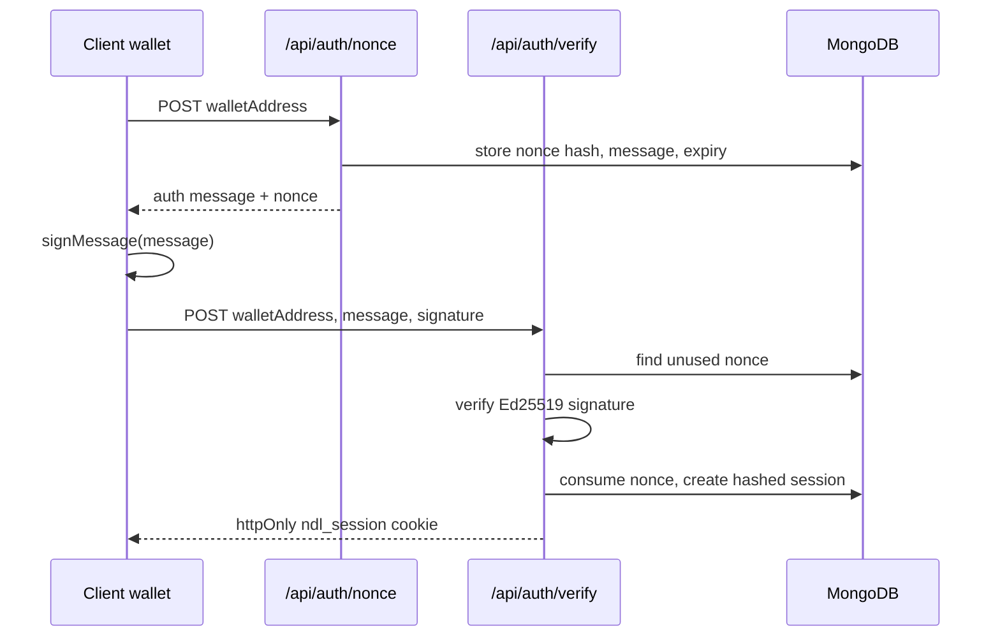
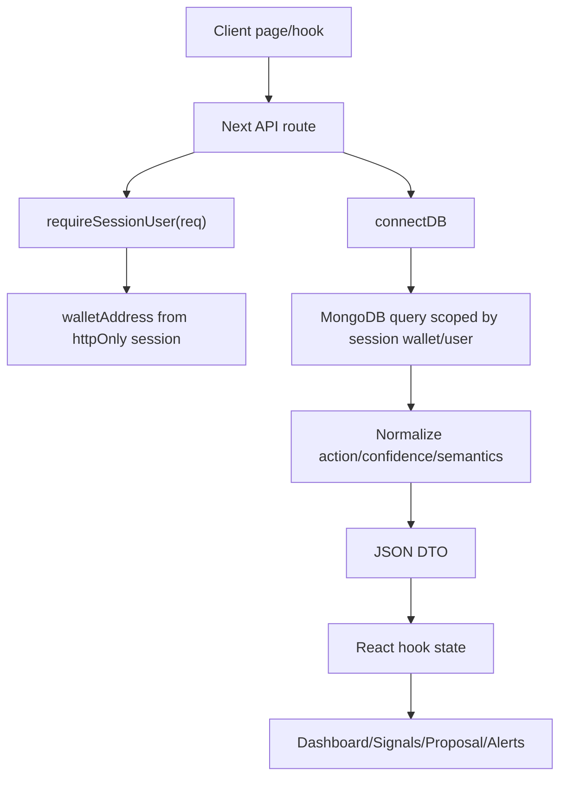
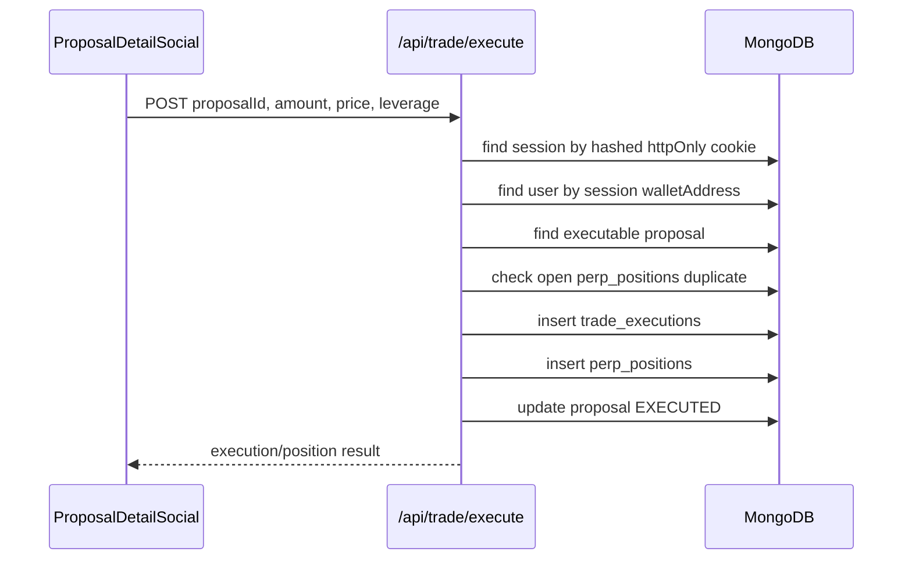

```mermaid
sequenceDiagram
  participant UI as Client wallet
  participant Nonce as /api/auth/nonce
  participant Verify as /api/auth/verify
  participant DB as MongoDB
  UI->>Nonce: POST walletAddress
  Nonce->>DB: store nonce hash, message, expiry
  Nonce-->>UI: auth message + nonce
  UI->>UI: signMessage(message)
  UI->>Verify: POST walletAddress, message, signature
  Verify->>DB: find unused nonce
  Verify->>Verify: verify Ed25519 signature
  Verify->>DB: consume nonce, create hashed session
  Verify-->>UI: httpOnly ndl_session cookie
```

```mermaid
graph TD
  Client["Client page/hook"] --> Route["Next API route"]
  Route --> Session["requireSessionUser(req)"]
  Session --> Wallet["walletAddress from httpOnly session"]
  Route --> Connect["connectDB"]
  Connect --> Query["MongoDB query scoped by session wallet/user"]
  Query --> Normalize["Normalize action/confidence/semantics"]
  Normalize --> Response["JSON DTO"]
  Response --> Hook["React hook state"]
  Hook --> UI["Dashboard/Signals/Proposal/Alerts"]
```

```mermaid
sequenceDiagram
  participant UI as ProposalDetailSocial
  participant API as /api/trade/execute
  participant DB as MongoDB
  UI->>API: POST proposalId, amount, price, leverage
  API->>DB: find session by hashed httpOnly cookie
  API->>DB: find user by session walletAddress
  API->>DB: find executable proposal
  API->>DB: check open perp_positions duplicate
  API->>DB: insert trade_executions
  API->>DB: insert perp_positions
  API->>DB: update proposal EXECUTED
  API-->>UI: execution/position result
```
