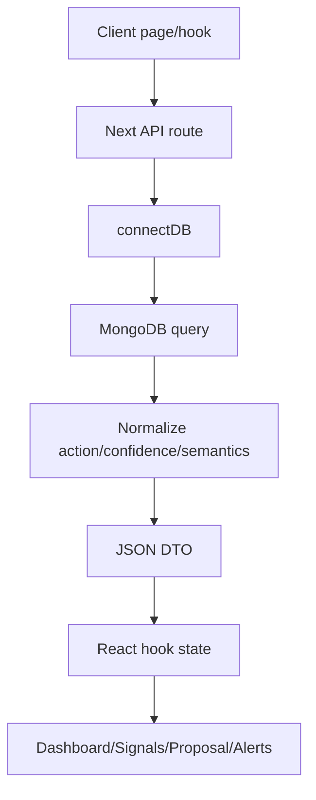
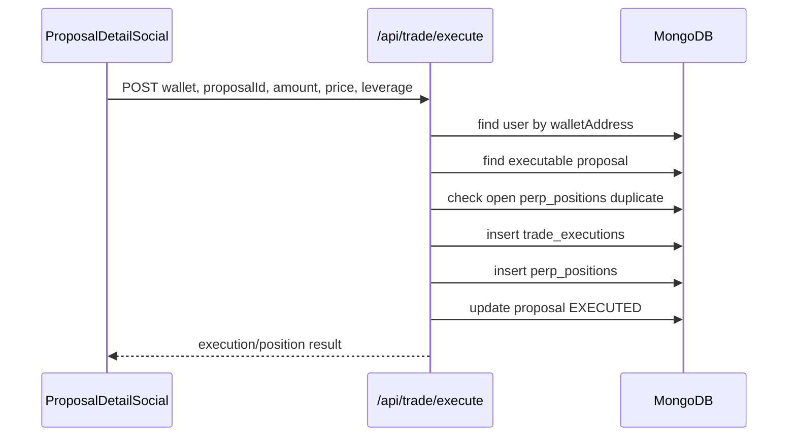

```mermaid
graph TD
  Client["Client page/hook"] --> Route["Next API route"]
  Route --> Connect["connectDB"]
  Connect --> Query["MongoDB query"]
  Query --> Normalize["Normalize action/confidence/semantics"]
  Normalize --> Response["JSON DTO"]
  Response --> Hook["React hook state"]
  Hook --> UI["Dashboard/Signals/Proposal/Alerts"]
```

```mermaid
sequenceDiagram
  participant UI as ProposalDetailSocial
  participant API as /api/trade/execute
  participant DB as MongoDB
  UI->>API: POST wallet, proposalId, amount, price, leverage
  API->>DB: find user by walletAddress
  API->>DB: find executable proposal
  API->>DB: check open perp_positions duplicate
  API->>DB: insert trade_executions
  API->>DB: insert perp_positions
  API->>DB: update proposal EXECUTED
  API-->>UI: execution/position result
```

