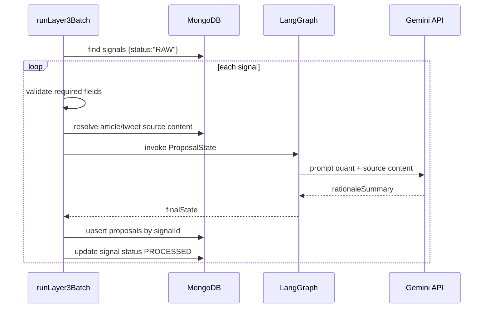

```mermaid
sequenceDiagram
  participant Batch as runLayer3Batch
  participant DB as MongoDB
  participant Graph as LangGraph
  participant Gemini as Gemini API
  Batch->>DB: find signals {status:"RAW"}
  loop each signal
    Batch->>Batch: validate required fields
    Batch->>DB: resolve article/tweet source content
    Batch->>Graph: invoke ProposalState
    Graph->>Gemini: prompt quant + source content
    Gemini-->>Graph: rationaleSummary
    Graph-->>Batch: finalState
    Batch->>DB: upsert proposals by signalId
    Batch->>DB: update signal status PROCESSED
  end
```

