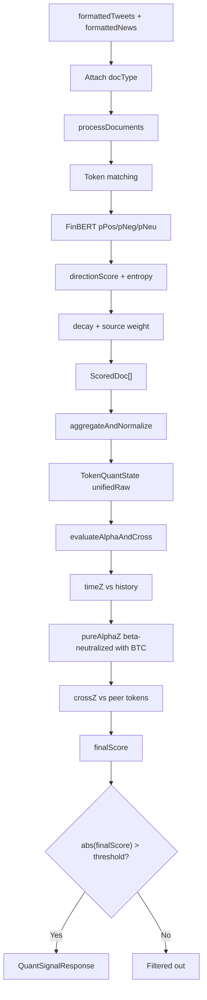

```mermaid
graph TD
  A["formattedTweets + formattedNews"] --> B["Attach docType"]
  B --> C["processDocuments"]
  C --> D["Token matching"]
  D --> E["FinBERT pPos/pNeg/pNeu"]
  E --> F["directionScore + entropy"]
  F --> G["decay + source weight"]
  G --> H["ScoredDoc[]"]
  H --> I["aggregateAndNormalize"]
  I --> J["TokenQuantState unifiedRaw"]
  J --> K["evaluateAlphaAndCross"]
  K --> L["timeZ vs history"]
  L --> M["pureAlphaZ beta-neutralized with BTC"]
  M --> N["crossZ vs peer tokens"]
  N --> O["finalScore"]
  O --> P{"abs(finalScore) > threshold?"}
  P -->|Yes| Q["QuantSignalResponse"]
  P -->|No| R["Filtered out"]
```

