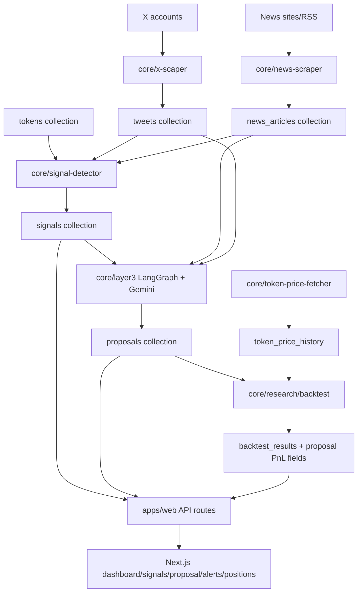

<!-- ```mermaid
sequenceDiagram
  participant Cron as core/run cron
  participant Quant as signal-detector
  participant DB as MongoDB
  participant L3 as layer3
  participant Web as apps/web
  Cron->>Quant: run-quant.ts
  Quant->>DB: read tweets/news/tokens/hyperparams
  Quant->>Quant: FinBERT + weighting + alpha normalization
  Quant->>DB: insert signals(status RAW)
  Cron->>L3: run-layer3.ts
  L3->>DB: read RAW signals and source content
  L3->>L3: Gemini rationale
  L3->>DB: upsert proposal, mark signal PROCESSED
  Web->>DB: API routes query signals/proposals/prices/positions
  Web->>Web: hooks normalize into analytics rows
```
 -->
